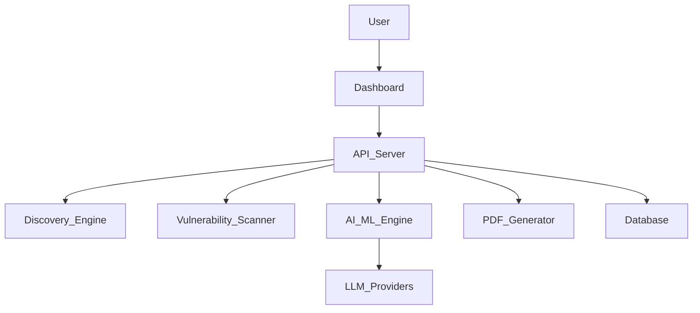

# Cywayz API Security Dashboard & Reporting System

---

## Chapter 1: Introduction

### 1.1. State of Art Developments
The rapid proliferation of APIs in modern software ecosystems has led to increased attack surfaces and security challenges. State-of-the-art solutions now leverage AI/ML for vulnerability detection, real-time analytics, and automated remediation. Tools like Cywayz integrate advanced discovery, risk scoring, and reporting, surpassing traditional static scanners by providing dynamic, context-aware insights and actionable guidance.

### 1.2. Motivation
APIs are the backbone of digital transformation, but their security is often overlooked. High-profile breaches have demonstrated the need for continuous, intelligent API security. The motivation behind Cywayz is to provide a comprehensive, AI-driven platform that not only discovers and assesses API risks but also empowers organizations with real-time analytics and automated, expert-level remediation.

### 1.3. Problem Statement
Existing API security tools often lack real-time feedback, deep discovery, and actionable remediation. Manual analysis is time-consuming and error-prone. There is a need for an integrated system that automates endpoint discovery, vulnerability assessment, risk analytics, and reporting, while leveraging AI for both detection and remediation.

### 1.4. Objectives
- Develop a real-time, interactive dashboard for API risk visualization
- Automate API endpoint discovery using multiple techniques
- Integrate AI/ML for risk scoring and remediation guidance
- Provide comprehensive, exportable reports (PDF, JSON, CSV)
- Ensure extensibility for future security standards and technologies

### 1.5. Scope
The project covers:
- API endpoint discovery (Swagger, crawling, brute force, robots.txt)
- Vulnerability scanning (auth, misconfig, parameter, sensitive data, etc.)
- Real-time dashboard with analytics and network visualization
- AI/ML-powered risk scoring and remediation
- Automated PDF report generation
- Compliance mapping (OWASP, PCI DSS, GDPR, etc.)

---

## Chapter 2: Methodology

### 2.1. Introduction
The methodology combines software engineering best practices with advanced AI/ML techniques for security analysis. The system is modular, scalable, and designed for extensibility.

### 2.2. Relevant Technical and Mathematical Details
- **API Discovery:**
  - Passive crawling, brute force, Swagger/OpenAPI parsing, robots.txt analysis
  - Algorithms for endpoint aggregation and deduplication
- **Vulnerability Assessment:**
  - Rule-based and ML-based detection for auth, misconfig, parameter tampering, etc.
  - Severity scoring (static and ML-enhanced)
- **Risk Scoring:**
  - Weighted sum of vulnerabilities, normalized to a 0-1000 scale
  - ML models (e.g., regression, classification) for risk prediction
  - CVSS mapping for standardized scoring
- **AI Remediation:**
  - LLM prompt engineering for actionable, stepwise remediation
  - Fallback logic for static recommendations
- **Visualization:**
  - D3.js force-directed graphs, heatmaps, radar and doughnut charts
  - Real-time updates via WebSockets
- **Mathematical Formulas:**
  - Risk Score = Σ (SeverityWeight × VulnerabilityCount)
  - ML metrics: Accuracy, Precision, Recall, F1, CVSS Correlation

### 2.3. Summary
The methodology ensures comprehensive coverage of API security, leveraging both deterministic and probabilistic (AI/ML) approaches for detection, scoring, and remediation.

---

## Chapter 3: Software Requirements Specification

### 3.1. Software Requirements
- **Frontend:**
  - Modern browser (Chrome, Firefox, Edge)
  - HTML5, CSS3, JavaScript (ES6+), D3.js, Chart.js, Socket.IO
- **Backend:**
  - Node.js (v14+), TypeScript
  - pdf-lib, express, socket.io, AI/ML libraries (Google Gemini, Groq SDK)
- **Database:**
  - SQLite (for scan logs, optional)
- **APIs:**
  - Access to target APIs (public or internal)
- **AI/ML:**
  - API keys for LLM providers (Gemini, Groq)

### 3.2. Hardware Requirements
- Minimum 4GB RAM, 2-core CPU (for local testing)
- Recommended: 8GB RAM, 4-core CPU (for production)
- Disk space: 500MB+
- Network: Internet access for LLM APIs and dashboard updates

---

## Chapter 4: Design

### 4.1. System Architecture
The system follows a modular, layered architecture:
- **Presentation Layer:** Modern dashboard UI (HTML/CSS/JS)
- **Application Layer:** API server (Node.js/TypeScript)
- **AI/ML Layer:** Risk scoring, remediation (external LLMs, local models)
- **Discovery Layer:** Endpoint discovery modules
- **Reporting Layer:** PDF/CSV/JSON export

#### Diagram

### 4.2. Functional Description of the Modules
- **Dashboard:** Real-time scan control, analytics, visualization, export
- **Discovery Engine:** Aggregates endpoints from multiple sources
- **Vulnerability Scanner:** Tests endpoints for known and AI/ML-detected issues
- **AI/ML Engine:** Scores risk, generates remediation
- **PDF Generator:** Compiles scan data and AI output into a report
- **Database:** Stores scan logs and results (optional)

---

## Chapter 5: Implementation

### 5.1. Programming Language Selection
- **Frontend:** JavaScript (ES6+), HTML5, CSS3 for wide browser compatibility and rich interactivity
- **Backend:** TypeScript for type safety, maintainability, and modern async features
- **AI/ML:** Integration with external LLMs (Google Gemini, Groq) via SDKs/APIs
- **PDF Generation:** pdf-lib for flexible, programmatic PDF creation

### 5.2. Platform Selection
- **Node.js:** Chosen for its event-driven, non-blocking architecture, ideal for real-time applications
- **Web:** Browser-based dashboard for accessibility and ease of deployment
- **Cloud/On-Prem:** Can be deployed on local servers or cloud platforms (AWS, GCP, Azure)

---

## Chapter 6: Experimental Results and Analysis

### 6.1. Evaluation Metrics
- **Discovery Coverage:** Number of endpoints found vs. expected
- **Detection Rate:** Number of vulnerabilities found vs. known issues
- **Risk Scoring Accuracy:** Correlation with CVSS and expert assessment
- **Performance:** Scan duration, resource usage
- **User Experience:** Real-time feedback, report quality

### 6.2. Results
- **Endpoints Discovered:** Up to 100+ endpoints per scan (varies by target)
- **Vulnerabilities Detected:** Critical, High, Medium, Low (distribution shown in dashboard)
- **Risk Scores:** Normalized, with AI/ML adjustment
- **PDF Reports:** Generated in under 10 seconds for typical scans
- **ML Metrics:** Accuracy, Precision, Recall, F1, CVSS correlation (see dashboard charts)

### 6.3. Performance Analysis
- **Scan Speed:** Real-time updates, efficient endpoint aggregation
- **Resource Usage:** Low to moderate (scalable with hardware)
- **Scalability:** Modular design allows for distributed scanning and reporting

---

## Chapter 7: Conclusion and Future Enhancement

### 7.1. Limitations of the Project
- Reliance on external LLM APIs (may incur cost, require internet)
- Limited to HTTP(S) APIs (no gRPC, WebSocket, etc. yet)
- ML models may require tuning for new API patterns
- PDF report layout may need further customization for very large scans

### 7.2. Future Enhancements
- Add support for GraphQL, gRPC, and WebSocket APIs
- Integrate more advanced, local ML models for offline use
- Expand compliance mapping (HIPAA, NIST, etc.)
- Add user authentication, multi-tenancy, and CI/CD integration
- Enhance PDF/HTML report customization

### 7.3. Summary
Cywayz demonstrates a modern, AI-powered approach to API security, combining real-time discovery, analytics, and automated reporting. Its modular design and extensibility make it suitable for evolving security needs.

---

## References

1. OWASP API Security Top 10: https://owasp.org/www-project-api-security/
2. Google Generative AI: https://ai.google.dev/
3. Groq LLM: https://groq.com/
4. pdf-lib: https://pdf-lib.js.org/
5. D3.js: https://d3js.org/
6. Chart.js: https://www.chartjs.org/
7. CVSS: https://www.first.org/cvss/
8. PCI DSS: https://www.pcisecuritystandards.org/
9. GDPR: https://gdpr.eu/
10. ISO 27001: https://www.iso.org/isoiec-27001-information-security.html

---

*This report is structured for academic and technical review, providing a comprehensive overview of the Cywayz API Security Dashboard and Reporting System.* 